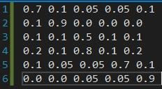
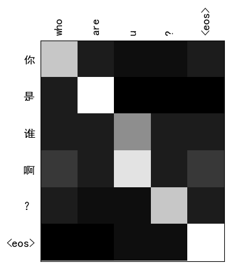

# DrawGrayScale

## Setting up the repository 
>requirements: 
1. python 2.7
2. matplotlib 
3. pillow & ipyton (not necessary)

## Data format

1. Chinese

      

2. English 

      

3. Alignment (x for English, y for Chinese)

      

## DrawGrayScale Usage 

#### linux usage 
    python drawgrayscale_linux.py  ./data/file.ch  ./data/file.en  ./data/file.align  ./data/fileout 
#### windows usage 
    python drawgrayscale.py  ./data/file.ch  ./data/file.en  ./data/file.align  ./data/fileout 

## Examples 

With the data provided, you can get an image as follows:

      

## Tips

#### Windows_Tips
if you want to draw a picture with Chinese characters, as in drawgrayscale.py(line 70),  links are listed:
[solution1](https://segmentfault.com/a/1190000005144275), [solution2](http://www.imekaku.com/2015/12/11/matplotlib-charset/), [solution3](https://www.zhihu.com/question/25404709) 
or just move `font/simhei.ttf` to `$PYTHON_PATH\Lib\site-packages\matplotlib\mpl-data\fonts\ttf` (windows only)

#### Linux_tips 
if you wang to draw a picture with Chinese characters on top of linux, as in drawgrayscale_line.py(line 15), you may change the path with your own Chinese character path.
links are listed as follows: [solution_linux](http://blog.csdn.net/dgatiger/article/details/50414549)

